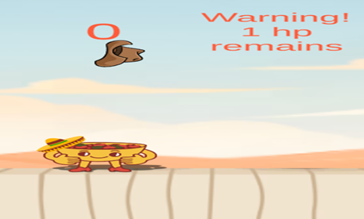

# dia-de-los-muertos
Dia De Los Muertos is simply a food-fall game with a unique concept as you can understand from the name.

**My Experiences**
My first Unity project, Dia De Los Muertos, marked my initial journey into game development and introduced me to programming with C#. This project was challenging yet highly educational, requiring several days of exploration through tutorials, courses, and extensive trial-and-error to grasp Unity's interface and the fundamentals of C#. The hands-on approach significantly deepened my understanding and prepared me for more advanced game development tasks.

I chose to create a simple yet engaging food-falling game inspired by the Mexican tradition of Dia De Los Muertos (Day of the Dead). In this game, players control a Mexican-themed bowl character tasked with collecting falling food items while avoiding harmful objects. The game ends if the player collides with dangerous objects twice. The concept was chosen for its uniqueness and thematic coherence.

Initially, I sourced and customized assets, including food items, backgrounds, harmful objects, and character graphics from Canva, adding elements like a Mexican hat to strengthen the game's thematic integrity. This was followed by creating game objects, rigidBody components, colliders, background and foreground elements, spawn points for falling objects, and invisible walls to keep the character within game boundaries. These tasks were crucial in helping me become proficient with Unity’s fundamental components.

Developing scripts represented the most challenging aspect of the project, especially due to my initial unfamiliarity with C#. I created a collisionController script to manage object interactions, determining whether colliding items were beneficial (adding points) or harmful (reducing lives). Additionally, the gameManager script handled random spawning of props to ensure varied gameplay experiences.

To enhance gameplay dynamics, I wrote two additional scripts: one controlling character movement using the player's touch input (worldTouchPos) and another managing random rotation and timely destruction of falling objects to optimize performance. Implementing UI elements added essential finishing touches to the game.

However, my first playtest on an Android device revealed numerous bugs and gameplay issues. This taught me the critical importance of thorough testing and iterative debugging. After dedicated debugging sessions, fine-tuning gameplay mechanics, and optimizing performance, the game reached a polished state.

Ultimately, this initial project was incredibly rewarding, providing me with foundational skills and insights essential for future game development endeavors.

